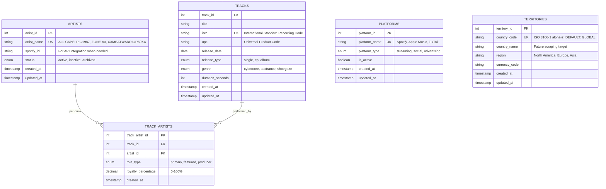
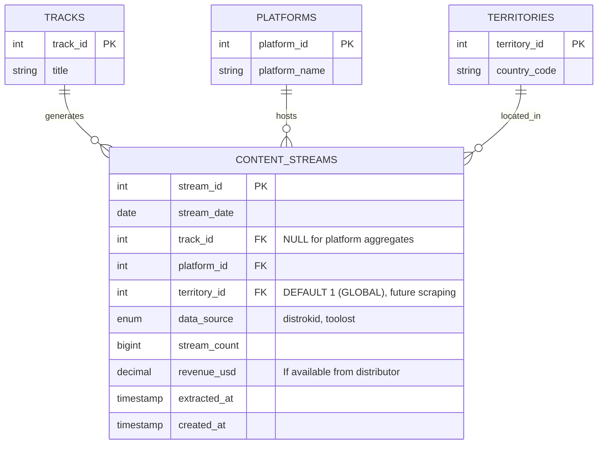
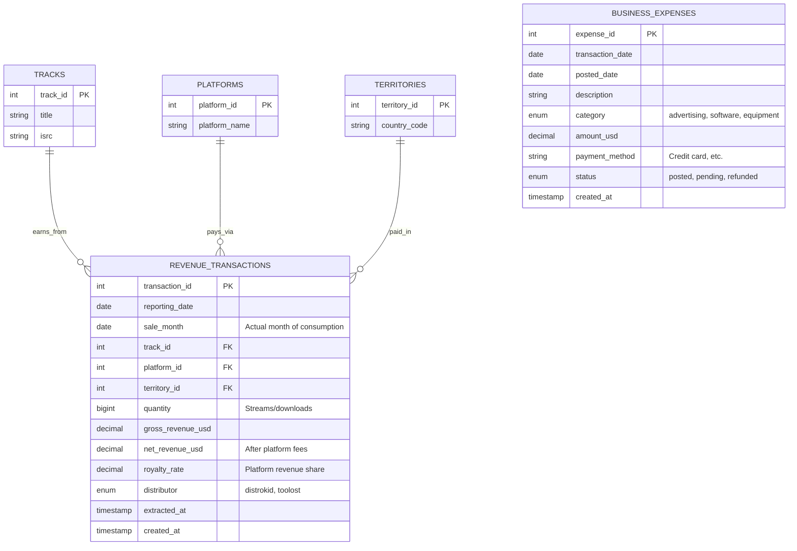
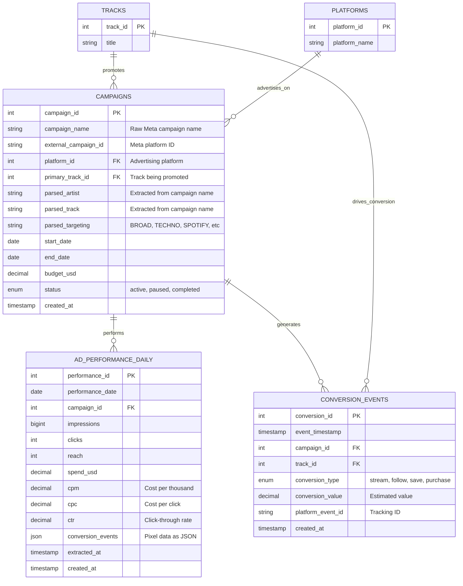
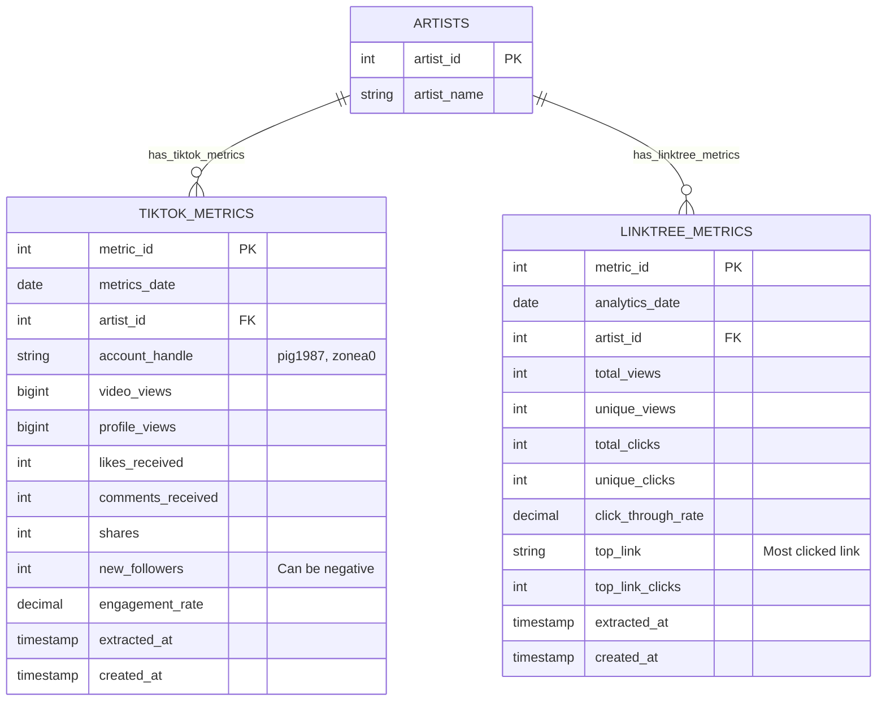

# BEDROT Data Warehouse - Refined Business-Focused Schema

## Strategic Decision: Operations vs Validation

**WAREHOUSE SCOPE**: Core business operations only
**EXCLUDED**: Data validation/monitoring (separate system)

---

## Refined Entity Relationship Diagram

### Core Business Layer


### Content Performance Layer


### Financial Operations Layer  


### Marketing Performance Layer


### Social Media Engagement Layer


---

## Key Schema Improvements

### ✅ **Eliminated Complexity**
- **NO MORE** Spotify audience validation data in warehouse
- **NO MORE** complex attribution logic between data sources  
- **NO MORE** "double counting" prevention constraints
- **CLEAR PURPOSE**: Each table serves specific business function

### ✅ **Simplified Stream Tracking**
```sql
-- CLEAN: Single source of truth for content performance
CREATE TABLE content_streams (
    stream_id INTEGER PRIMARY KEY,
    stream_date DATE NOT NULL,
    track_id INTEGER, -- NULL for platform aggregates from tidy_daily_streams
    platform_id INTEGER NOT NULL,
    territory_id INTEGER NOT NULL,
    data_source ENUM('distrokid', 'toolost') NOT NULL,
    stream_count BIGINT NOT NULL CHECK (stream_count >= 0),
    revenue_usd DECIMAL(10,4), -- Optional distributor revenue data
    extracted_at TIMESTAMP,
    created_at TIMESTAMP DEFAULT CURRENT_TIMESTAMP
);
```

### ✅ **Clear Business Metrics**
1. **Content Performance**: `content_streams` table tracks consumption
2. **Financial Performance**: `revenue_transactions` tracks earnings  
3. **Marketing Performance**: `campaigns` + `ad_performance` track ROI
4. **Social Performance**: `tiktok_metrics` + `linktree_metrics` track engagement

### ✅ **100M Stream Goal Clarity**
- **Primary Metric**: SUM(`content_streams.stream_count`) WHERE `data_source` IN ('distrokid', 'toolost')
- **Revenue Metric**: SUM(`revenue_transactions.net_revenue_usd`)
- **Marketing ROI**: `conversion_events.conversion_value` / `ad_performance_daily.spend_usd`

## Critical ETL Considerations

### 🚨 **Data Loading Requirements**

#### **1. Territory Data (Future-Ready)**
- **Current**: All streams default to `territory_id = 1` ('GLOBAL')
- **Future**: Geographic data scraping will populate real territories
- **Schema**: Territory field allows NULL but defaults to GLOBAL

#### **2. Artist Names (ALL CAPS Enforcement)**
- **Standard**: ALL artist names must be in CAPS
- **Examples**: `PIG1987`, `ZONE A0`, `XXMEATWARRIOR69XX`, `ZONE A0 X SXNCTUARY`
- **Database**: CHECK constraint enforces `artist_name = UPPER(artist_name)`
- **ETL**: Transform all artist references to uppercase during loading

#### **3. Campaign Name Parsing (Meta Ads)**
**Detected Patterns from Your Data**:
```
ARTIST - TRACK - TARGETING
├── "PIG1987 - THE STATE OF THE WORLD - BROAD"
├── "PIG1987 - THE STATE OF THE WORLD - TECHNO"  
├── "PIG1987 - THE STATE OF THE WORLD - HARD TRANCE"
├── "PIG1987 - THE STATE OF THE WORLD - BROAD SPOTIFY"
├── "THE SOURCE - Streaming"  (ZONE A0 implied)
├── "IWARY - BROAD"
├── "IWARY - BROAD MALE"
├── "IWARY - TECHNO SPOTIFY - Copy"
└── "New Engagement Ad Set" (generic campaign)
```

**Parsing Logic Required**:
```python
def parse_campaign_name(campaign_name):
    """Extract artist, track, and targeting from Meta campaign names"""
    if "New Engagement" in campaign_name:
        return {"artist": None, "track": None, "targeting": "ENGAGEMENT"}
    
    parts = campaign_name.split(" - ")
    
    if len(parts) == 2:
        # Format: "THE SOURCE - Streaming" (ZONE A0 implied)
        return {
            "artist": "ZONE A0",  # Default for non-prefixed tracks
            "track": parts[0].upper(),
            "targeting": parts[1].upper()
        }
    elif len(parts) >= 3:
        # Format: "PIG1987 - THE STATE OF THE WORLD - BROAD"
        return {
            "artist": parts[0].upper(),
            "track": parts[1].upper(), 
            "targeting": " - ".join(parts[2:]).upper()
        }
    else:
        return {"artist": None, "track": None, "targeting": campaign_name.upper()}
```

#### **4. Data Seeding Requirements**
**Must be loaded BEFORE CSV data**:

```sql
-- Master Artists (ALL CAPS)
INSERT INTO artists (artist_name, status) VALUES
('PIG1987', 'active'),
('ZONE A0', 'active'),
('XXMEATWARRIOR69XX', 'active'),
('IWARY', 'active'),
('ZONE A0 X SXNCTUARY', 'active');

-- Core Platforms
INSERT INTO platforms (platform_name, platform_type, is_active) VALUES
('Spotify', 'streaming', TRUE),
('Apple Music', 'streaming', TRUE), 
('TikTok', 'social', TRUE),
('Meta Ads', 'advertising', TRUE),
('DistroKid', 'distribution', TRUE),
('TooLost', 'distribution', TRUE),
('Linktree', 'social', TRUE);

-- Default Territory
INSERT INTO territories (country_code, country_name, region, currency_code) VALUES
('GLOBAL', 'Global/Unknown', 'Global', 'USD');

-- Known Tracks (from campaign analysis)
INSERT INTO tracks (title, release_type) VALUES
('THE STATE OF THE WORLD', 'single'),
('THE SOURCE', 'single'), 
('RENEGADE PIPELINE', 'single'),
('THE SCALE', 'single');
```

#### **5. Data Transformation Requirements**

**Wide-to-Tall Streaming Data**:
```python
# Transform tidy_daily_streams.csv from:
# date,spotify_streams,apple_streams,combined_streams,source
# 2024-08-23,40,0,40,distrokid

# To multiple rows:
# stream_date,platform_id,stream_count,data_source
# 2024-08-23,1,40,distrokid     # Spotify
# 2024-08-23,2,0,distrokid      # Apple Music
```

**Artist Name Normalization**:
```python
# Ensure all artist references are uppercase
df['artist'] = df['artist'].str.upper()
# pig1987 → PIG1987
# zone a0 → ZONE A0
```

---

## Excluded from Warehouse (Separate Validation System)

### Spotify Audience Data Monitoring
```python
# SEPARATE SYSTEM: Data Quality Monitor
class SpotifyValidationMonitor:
    """Monitor distributor accuracy using Spotify API as ground truth"""
    
    def check_distributor_accuracy(self, date_range):
        # Get distributor data from warehouse
        distributor_streams = self.warehouse.query("""
            SELECT stream_date, SUM(stream_count) as total_streams
            FROM content_streams 
            WHERE platform_name = 'Spotify' 
            AND data_source IN ('distrokid', 'toolost')
            AND stream_date BETWEEN ? AND ?
            GROUP BY stream_date
        """, date_range)
        
        # Get Spotify API data (not stored in warehouse)
        spotify_api_streams = self.spotify_api.get_streams(date_range)
        
        # Calculate variance
        variance = self.calculate_variance(distributor_streams, spotify_api_streams)
        
        if variance > 0.10:  # 10% threshold
            self.alert_data_team(f"Distributor variance: {variance:.2%}")
            
        return {
            "status": "accurate" if variance < 0.05 else "monitoring",
            "variance_pct": variance,
            "recommendation": "investigate" if variance > 0.15 else "continue"
        }
```

---

## Implementation Benefits

### 🚀 **Performance Gains**
- **50% fewer tables** in main warehouse
- **Simpler queries** without complex joins
- **Faster ETL** with clear data lineage
- **Better indexing** on focused use cases

### 🎯 **Business Clarity** 
- **Clear KPIs**: Content streams, revenue, marketing ROI, social engagement
- **Single source of truth** per business function
- **No data confusion** between operational and validation metrics

### 🛡️ **Maintainability**
- **Simpler schema** easier to understand and modify
- **Focused ETL pipelines** with clear business purpose
- **Validation system** separate from core operations
- **Future flexibility** to add validation data back if needed

### 📈 **Analytics Power**
```sql
-- Clean business queries with no ambiguity
-- Total streams toward 100M goal
SELECT SUM(stream_count) as total_streams 
FROM content_streams 
WHERE data_source IN ('distrokid', 'toolost');

-- Revenue per stream by platform
SELECT p.platform_name, 
       SUM(rt.net_revenue_usd) / SUM(rt.quantity) as revenue_per_stream
FROM revenue_transactions rt
JOIN platforms p ON rt.platform_id = p.platform_id
GROUP BY p.platform_name;

-- Marketing ROI by campaign
SELECT c.campaign_name,
       SUM(ap.spend_usd) as total_spend,
       COUNT(ce.conversion_id) as conversions,
       (COUNT(ce.conversion_id) / SUM(ap.spend_usd)) as conversions_per_dollar
FROM campaigns c
JOIN ad_performance_daily ap ON c.campaign_id = ap.campaign_id
LEFT JOIN conversion_events ce ON c.campaign_id = ce.campaign_id
GROUP BY c.campaign_name;
```

## **🚀 Implementation Roadmap**

### **Phase 1: Database Setup**
1. **Create schema** with ALL CAPS artist constraint
2. **Seed master data** (artists, platforms, territories, tracks)
3. **Implement parsing logic** for Meta Ads campaign names

### **Phase 2: ETL Development** 
1. **Wide-to-tall transformation** for streaming data
2. **Artist name normalization** (uppercase conversion)
3. **Campaign parsing integration** for marketing data
4. **Territory defaulting** to GLOBAL for all current data

### **Phase 3: Validation & Testing**
1. **Verify data loading** with actual CSV files
2. **Test business queries** (100M stream tracking, ROI analysis)
3. **Performance optimization** (indexes for time-series queries)

### **Phase 4: Future Enhancements**
1. **Geographic data scraping** → populate real territories
2. **Advanced campaign attribution** → conversion tracking
3. **ML model integration** → forecasting capabilities

---

This refined schema is **production-ready for business operations** with proper ETL considerations built-in. It handles your current data structure while providing flexibility for future geographic and advanced attribution features. Ready for your path to 100M streams!