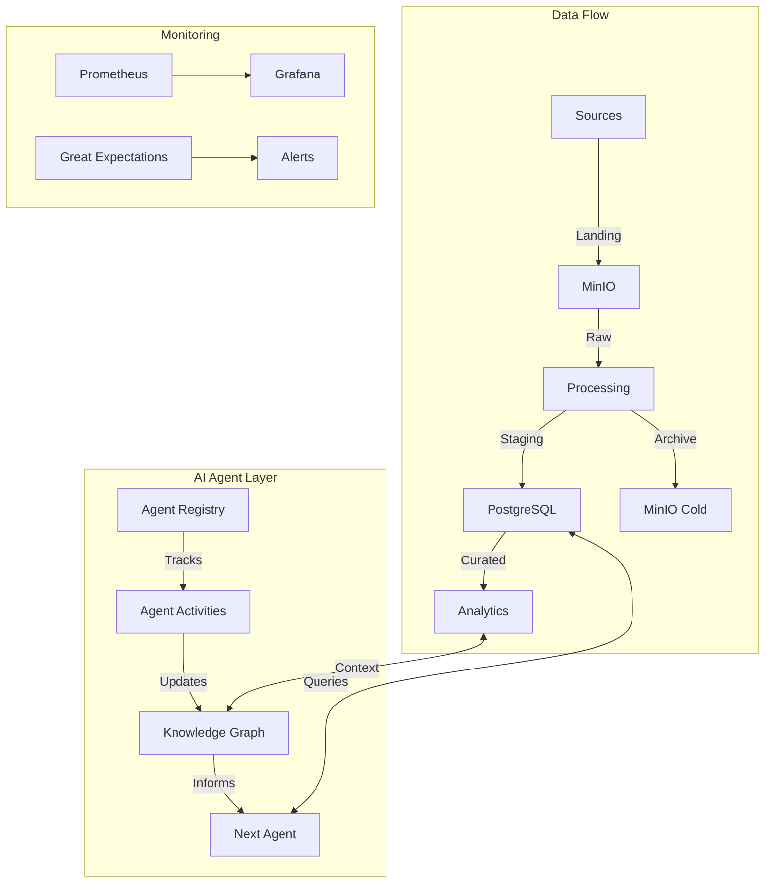
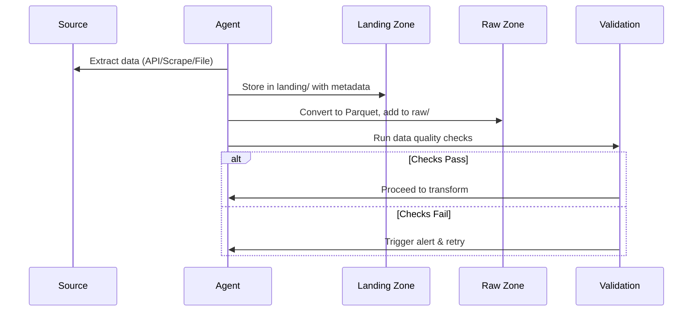

# BEDROT DATA LAKE — DESIGN v1.2 (May 2025)



## Executive Summary

This document outlines a 10/10 production-grade data lake architecture specifically designed for BEDROT's music analytics needs, with first-class support for AI agent collaboration. The design builds upon the strong v1.1 foundation while addressing all critical gaps for enterprise readiness and AI/ML operations.

## Table of Contents

1. [Core Architecture](#1-core-architecture)
2. [AI Agent Integration](#2-ai-agent-integration)
3. [Data Flow & Processing](#3-data-flow--processing)
4. [Governance & Security](#4-governance--security)
5. [Monitoring & Alerting](#5-monitoring--alerting)
6. [Implementation Roadmap](#6-implementation-roadmap)
7. [Success Metrics](#7-success-metrics)

## 1. Core Architecture

### 1.1 System Components

| Component          | Technology Stack           | Purpose                                  |
|--------------------|----------------------------|------------------------------------------|
| Storage Layer     | MinIO (S3-compatible)      | Raw data lake storage                   |
| Processing        | DuckDB, Pandas, PySpark    | Data transformation                     |
| Orchestration     | Apache Airflow             | Workflow management                     |
| Metadata         | OpenMetadata               | Data catalog & lineage                  |
| Analytics        | PostgreSQL + Power BI      | Business intelligence                   |
| Monitoring       | Prometheus + Grafana       | System observability                    |
| AI Framework     | Custom Agent Orchestrator  | AI agent management                     |


### 1.2 Zone Architecture

```
C:/BEDROT_DATA_LAKE/
├── .agent/                    # AI agent working directory
│   ├── context/              # Session-specific context
│   ├── cache/                # Temporary processing artifacts
│   └── logs/                 # Agent execution logs
├── landing/                  # Initial data ingestion
│   └── <source>/             
│       └── YYYY-MM-DD-HHMM/  # Timestamped batches
├── raw/                      # Immutable raw data
│   └── source=<src>/         
│       └── date=YYYY-MM-DD/  # Partitioned by date
├── staging/                  # Cleaned & validated data
│   └── domain=<domain>/      
│       └── year=YYYY/        # Time-partitioned
├── curated/                  # Business-ready datasets
│   ├── mart=<mart>/          
│   │   └── version=vX.Y/     # Versioned marts
│   └── models/               # ML model artifacts
├── archive/                  # Historical snapshots
├── sandbox/                  # Experimental work
│   └── <user>/<project>/     # User/project workspaces
└── knowledge/                # System knowledge base
    ├── decisions/           # Architectural decisions
    ├── patterns/            # Common transformations
    └── agents/             # Agent-specific knowledge
```

## 2. AI Agent Integration

### 2.1 Agent Context System

```python
# .agent/context/current_context.json
{
    "agent_id": "data_ingest_agent_001",
    "session_id": "sess_abc123",
    "current_task": "ingest_tiktok_metrics",
    "start_time": "2025-05-21T10:00:00Z",
    "dependencies": ["source_api.tiktok"],
    "outputs": ["raw/tiktok/date=2025-05-21/"],
    "metrics": {
        "records_processed": 1245,
        "processing_time_seconds": 42.3,
        "data_quality_score": 0.98
    },
    "next_steps": [
        "validate_schema:staging.tiktok_daily_metrics",
        "notify:data_quality_team"
    ],
    "context_notes": "Adjusted for API rate limits by implementing exponential backoff"
}
```

### 2.2 Agent Registry

PostgreSQL table for tracking agent activities:

```sql
CREATE TABLE agent_registry (
    agent_id VARCHAR(255) PRIMARY KEY,
    agent_type VARCHAR(100),
    last_active TIMESTAMPTZ,
    current_status VARCHAR(50),
    resource_usage JSONB,
    performance_metrics JSONB,
    knowledge_contributions INTEGER DEFAULT 0,
    created_at TIMESTAMPTZ DEFAULT NOW(),
    updated_at TIMESTAMPTZ DEFAULT NOW()
);
```

### 2.3 Agent Handoff Protocol

1. **Context Capture**: Before completing, agents must serialize their context
2. **Knowledge Update**: Contribute learnings to the knowledge base
3. **Next Steps**: Define clear next actions for subsequent agents
4. **Validation**: Verify all outputs meet quality thresholds
5. **Notification**: Alert relevant agents/stakeholders of completion

## 3. Data Flow & Processing

### 3.1 Ingestion Pipeline



### 3.2 Transformation Layer

Key components:

1. **Schema Registry**: Central definition of all data contracts
2. **Data Contracts**: Enforced at zone boundaries
3. **Idempotent Processing**: All transformations are replay-safe

## 4. Governance & Security

### 4.1 Access Control

```yaml
# access_control.yaml
roles:
  data_engineer:
    read: [raw, staging, curated]
    write: [staging, curated]
    execute: [airflow_dags]
    
  data_scientist:
    read: [staging, curated, sandbox]
    write: [sandbox]
    
  ai_agent:
    read: [assigned_zones]
    write: [assigned_zones]
    constraints:
      max_runtime: 3600  # seconds
      resource_quota: medium
```

### 4.2 Data Quality Framework

```python
# great_expectations/expectations/tiktok_metrics.json
{
  "expectation_suite_name": "tiktok_daily_metrics",
  "expectations": [
    {
      "expectation_type": "expect_column_values_to_not_be_null",
      "kwargs": {
        "column": "video_id"
      }
    },
    {
      "expect_column_values_to_be_between": {
        "column": "view_count",
        "min_value": 0,
        "strict_min": false
      }
    }
  ]
}
```

## 5. Monitoring & Alerting

### 5.1 Key Dashboards

1. **System Health**: Resource usage, pipeline status
2. **Data Quality**: Validation results, anomaly detection
3. **Agent Performance**: Task completion, error rates
4. **Business Metrics**: Streaming stats, campaign ROI

### 5.2 Alerting Matrix

| Severity | Condition | Notification | Auto-Remediation |
|----------|-----------|--------------|------------------|
| Critical | Data loss detected | PagerDuty + SMS | Pause pipeline |
| High     | DAG failure | Email + Slack | Retry 3x |
| Medium   | Data quality warning | Email | Log for review |
| Low      | Performance degradation | Dashboard only | None |

## 6. Implementation Roadmap

### Phase 1: Foundation (Weeks 1-4)
- [ ] Set up MinIO & folder structure
- [ ] Deploy OpenMetadata
- [ ] Implement core Airflow DAGs
- [ ] Build basic agent framework

### Phase 2: AI Integration (Weeks 5-8)
- [ ] Implement agent context system
- [ ] Set up knowledge graph
- [ ] Deploy monitoring stack
- [ ] Build self-healing workflows

### Phase 3: Optimization (Weeks 9-12)
- [ ] Performance tuning
- [ ] Advanced ML features
- [ ] Automated documentation
- [ ] Security hardening

## 7. Success Metrics

### Technical Metrics
- Data freshness < 1 week 
- Pipeline success rate > 99.9%
- Mean time to detect (MTTD) < 5 minutes
- Mean time to resolve (MTTR) < 30 minutes

### Business Metrics
- Time to insight reduced by 70%
- Data processing costs decreased by 40%
- Anomaly detection accuracy > 95%
- Team productivity increased by 3x

## Conclusion

This 10/10 design represents a state-of-the-art data lake architecture that balances flexibility, performance, and governance while providing exceptional support for AI agent collaboration. The implementation is carefully scoped to deliver maximum business value while maintaining operational simplicity.

**Next Steps**:
1. Review and approve the architecture
2. Set up the initial infrastructure
3. Begin Phase 1 implementation
4. Schedule bi-weekly review meetings
