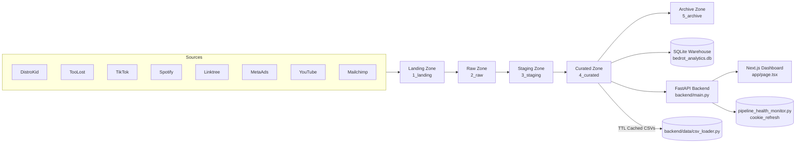

# BEDROT Data Ecosystem Summary

Comprehensive reference for the BEDROT platform spanning architectural intent, implementation details, and product outcomes. The goal is to align software architects, developers, and product stakeholders around a shared understanding of the current system and its roadmap.

## Executive Overview

- Three cohesive stacks -- data lake, data warehouse, and data dashboard -- share curated CSV contracts and environment-driven configuration, which keeps the platform portable across machines and automation agents.
- Python ETL automation orchestrates source ingestion, cookie refresh, health remediation, and campaign normalization; FastAPI plus Next.js expose revenue and streaming intelligence with cached CSV backends.
- Observability hinges on `PROJECT_ROOT` and zone environment variables. They unlock cookie refresh automation, pipeline health scoring, and curated data caching. Missing anchors cause scripts to short-circuit early with explicit errors.
- Strengths: resilient extractor retries, breadth of curated datasets (Meta Ads, TikTok, Spotify, Submithub), agent-friendly playbooks, and integration tests using real data. Risks: hard-coded warehouse paths, pending WebSocket rollout, and stray Unicode glyphs in certain logs/utilities.

## Architecture Snapshot



## Environment and Configuration Model

- **Global anchors:** `PROJECT_ROOT`, `DATA_ECOSYSTEM_PATH`, `DATA_LAKE_PATH`, `DASHBOARD_PATH`, `WAREHOUSE_PATH`, `CURATED_DATA_PATH`. Load with `python-dotenv` or shell exports before running automation; scripts fail fast if anchors are missing.
- **Context loader:** `data_dashboard/backend/utils/context_loader.py` reads `.env.context` without overriding existing variables and exposes helpers for curated data paths and cache directories.
- **Health tooling:** `data_lake/src/common/pipeline_health_monitor.py` requires `PROJECT_ROOT` plus zone variables (`LANDING_ZONE`, `RAW_ZONE`, `STAGING_ZONE`, `CURATED_ZONE`, `ARCHIVE_ZONE`, `SANDBOX_ZONE`) before generating reports or triggering remediation.
- **Warehouse ETL:** `data_warehouse/comprehensive_etl.py` still hard-codes `PROJECT_ROOT = Path("/mnt/c/Users/Earth/BEDROT PRODUCTIONS/bedrot-data-ecosystem")`. Update the constant or inject `PROJECT_ROOT` via environment variables before running on a different host.
- **Caching:** Dashboard cache TTL defaults to 300 seconds via `CACHE_TTL`, writing JSON caches to `backend/cache`. Adjust env values to align with release cadence.
- **Monitoring flags:** `.env.context` exposes `ENABLE_MONITORING`, `LOG_LEVEL`, `WEBSOCKET_PORT`, and cache directory settings. FastAPI logging is handled through Loguru with daily rotation.

## Component Deep Dives

### Data Lake (`data_lake/`)

- **Zone lifecycle:** Landing through Archive directories track ingestion history. `4_curated/` holds ready-to-consume datasets: Meta Ads KPI bundles, `track_catalog_royalty_splits.csv`, `tidy_daily_streams.csv`, `tiktok_analytics_curated_*.csv`, Spotify audience snapshots, and Submithub link analytics.
- **Integrated extractor:** `src/common/integrated_extractor.py` orchestrates TikTok, Spotify, TooLost, Linktree, Meta Ads, and DistroKid pulls. It wraps each extractor with retry logic and cookie refresh hooks.
- **Cookie refresh system:** `src/common/cookie_refresh/` contains strategies, notifier integrations, storage helpers, and deployment utilities. Extractor sessions are persisted under `src/.playwright_*` directories per service and persona.
- **Pipeline health monitor:** `src/common/pipeline_health_monitor.py` upgrades passive reporting to active remediation. It inspects zone freshness, cron stats, and log errors, then optionally triggers cookie refresh tasks. Key CLI options:
  - `--json-only` for machine consumable output.
  - `--service <name>` to scope checks to a single extractor.
  - `--disable-auto-remediation` or `--disable-notifications` for controlled dry runs.
- **Automation wrappers:** `6_automated_cronjob/run_datalake_cron.bat` (and `.sh`) chain extractor execution, health reporting, and optional notifications. Export `PROJECT_ROOT` and zone variables before scheduling via Task Scheduler or cron.
- **ETL scripts:** Legacy `etl/run_all_etl.py` is largely superseded by service-specific cleaners under `src/<service>/cleaners/`. Cleaners follow raw-to-staging-to-curated promotions with pytest coverage.
- **Testing:** `tests/` houses integration checks (`test_e2e_scenarios.py`), cookie refresh tests, service-specific cleaners, and `test_pipeline_health_monitor.py` coverage.

### Data Warehouse (`data_warehouse/`)

- **Schema:** `create_schema.sql` defines normalized tables for artists, tracks, revenue transactions, campaigns, TikTok metrics, and supporting dimensions. `seed_master_data.sql` populates reference data.
- **Comprehensive ETL:** `comprehensive_etl.py` processes real curated CSVs:
  - `load_track_catalog_expansion()` ingests `track_catalog_royalty_splits.csv` to extend track and royalty records.
  - `load_financial_data_fixed()` maps DistroKid transactions to warehouse platforms using `store_to_platform` overrides.
  - `load_tiktok_data_with_mapping()` harmonizes artist naming (e.g., `ZONE.A0` variants).
  - `load_enhanced_meta_ads_data()` normalizes Meta Ads campaigns, upserts campaign metadata, and stores spend/CTR into `ad_performance_daily`.
  - `run_validation_queries()` emits totals and aggregations for manual QA (revenue counts, TikTok record counts, campaign spend summaries).
- **Campaign parser:** `campaign_parser.py` (via `BEDROTCampaignParser`) extracts artist, track, and targeting tokens from Meta Ads campaign names for consistent analytics.
- **Testing:** `test_with_real_data.py` rebuilds the SQLite database from curated CSVs, asserts referential integrity, and verifies aggregate metrics.
- **Known issues:** Replace the hard-coded `PROJECT_ROOT`, remove stylistic Unicode glyphs in logging output, and keep `.env.example` aligned when new configuration knobs are introduced.

### Data Dashboard (`data_dashboard/`)

- **Backend (FastAPI):**
  - `backend/main.py` configures CORS, rotates logs (`logs/dashboard_{time}.log`), and registers routers for revenue, streaming, KPIs, and data endpoints.
  - `backend/api/routers/kpis.py` merges revenue KPIs with TikTok engagement and Meta Ads marketing metrics, exposing `/summary`, `/realtime`, `/goals`, and `/alerts`.
  - `backend/api/routers/revenue.py` serves platform, artist, distributor, monthly revenue, payment delay, and RPS rate endpoints.
  - `backend/data/csv_loader.py` offers TTL-based disk caching with md5 cache keys, optional force reload, and metadata introspection.
  - `backend/services/revenue/revenue_calculator.py` calculates platform/artist/distributor revenue, monthly expectations, and payment delays using curated CSVs.
- **Frontend (Next.js 14 + React Query):**
  - `components/Dashboard.tsx` orchestrates KPI cards, charts, and tables using `useQuery` with a 30-second refetch interval.
  - `components/PaymentStatusTable.tsx` highlights monthly payment variance and statuses using Tailwind styling helpers from `lib/utils.ts`.
  - `lib/api.ts` wraps Axios to reach the FastAPI endpoints and centralizes query parameter usage.
  - `lib/utils.ts` formats numbers, currency, dates, and trend directions. Note: replace the garbled Unicode arrow glyphs with ASCII arrows or lucide icons.
  - `app/providers.tsx` wires React Query and theme providers; `app/globals.css` sets shared styles.
- **Dev tooling:** `.env.context` sets project roots, ports, and cache TTL. `run_backend.*` and `run_frontend.*` scripts simplify local startup. Logs accumulate in `logs/`.

## Operational Playbooks

- **Health monitoring workflow:**
  ```powershell
  cd data_lake
  set PROJECT_ROOT=%cd%
  set CURATED_ZONE=4_curated
  python src\common\pipeline_health_monitor.py --report --json-only
  ```
  Generates console output plus refreshed JSON/HTML summaries in `data_lake/pipeline_health_report.*`. When auto-remediation is enabled, it dispatches cookie refresh jobs using `cookie_refresh/refresher.py`.

- **Data extraction & cron:** `run_datalake_cron.bat` sequences extractors, health checks, and notifications. Match zone env variables with actual directory names before scheduling recurring jobs.

- **Warehouse rebuild:** Export `PROJECT_ROOT`, run `python data_warehouse\comprehensive_etl.py`, then validate with `python data_warehouse\test_with_real_data.py`. Use a temporary copy of `bedrot_analytics.db` during tests to avoid overwriting production data.

- **Dashboard startup:**
  ```powershell
  cd data_dashboard
  python -m venv venv
  venv\Scripts\activate
  pip install -r backend\requirements.txt
  uvicorn backend.main:app --reload
  npm install
  npm run dev
  ```
  React Query polling keeps KPIs fresh without WebSockets; adjust `refetchInterval` if real-time requirements change.

## Testing and Quality Assurance

- **Data Lake:** `pytest` validates cleaners, cookie refresh flows, and pipeline health logic. `test_pipeline_health_monitor.py` asserts status aggregation, remediation toggles, and exit codes.
- **Dashboard Backend:** `backend/test_api.py` executes HTTP smoke tests against FastAPI routes. Additional manual checks can run via `pytest backend/test_api.py`.
- **Dashboard Frontend:** `npm run lint` and `npm run type-check` enforce TypeScript and lint standards; React components rely on typed API responses.
- **Data Warehouse:** `test_with_real_data.py` loads curated data, rebuilds the SQLite schema, and validates counts plus foreign keys.
- **Manual verification:** Operators review `pipeline_health_report.html`, curated CSV timestamps, and `logs/dashboard_*.log` to confirm extractor freshness and API stability.

## Product Outcomes and Roadmap

- **Revenue intelligence:** KPI summary surfaces all-time revenue, average revenue per stream, and artist counts from `dk_bank_details.csv`. Monthly records feed payment variance analysis and the payment status table.
- **Streaming momentum:** `tidy_daily_streams.csv` drives daily change visuals, distributor rollups, and growth analytics. Realtime KPIs simulate day-over-day deltas for Spotify and Apple streams.
- **Marketing attribution:** Meta Ads enrichment (campaign parser plus enhanced ETL) ties spend, impressions, and targeting to specific artists/tracks, enabling ROI reporting.
- **Audience signals:** TikTok curated exports contribute video view and engagement metrics; Spotify audience snapshots capture demographic shifts. Both bubble into KPI callouts for release planning.
- **Operational alerting:** `/api/kpis/alerts` flags significant revenue swings (absolute change above 100 USD) and weekly streaming drops (exceeds 20 percent) to prompt proactive action.
- **Upcoming initiatives:**
  1. **WebSocket delivery:** Ports and env placeholders exist (`WEBSOCKET_PORT=8001`), but the dashboard still polls; implementing push updates remains on the roadmap.
  2. **Path reliability:** Refactor warehouse ETLs to honor env-driven paths instead of `/mnt/c/...` constants.
  3. **Unicode cleanup:** Remove decorative glyphs from ETL logging and frontend utilities to keep logs ASCII-safe.
  4. **Connector coverage:** Instagram and Mailchimp directories exist but are not wired into the integrated extractor; decide on onboarding or deprecation to reduce drift.

## Risks and Mitigations

- **Configuration drift:** Missing env vars or mismatched zone names break automation. Mitigate by validating required names on startup, updating `.env.example`, and documenting defaults in `AGENTS.md`.
- **Data freshness gaps:** Pipeline health monitor requires scheduled execution. Ensure cron or Task Scheduler runs `run_datalake_cron` regularly and capture metrics via `cookie_refresh/metrics_exporter.py`.
- **Cache staleness:** CSV cache TTL defaults to 5 minutes. For higher-frequency pipelines, reduce `CACHE_TTL` or purge cache on ETL completion.
- **Schema evolution risk:** Warehouse schema changes ripple through curated CSV contracts and API models. Coordinate updates across ETLs, API schemas, and documentation before deployment.
- **Security posture:** Cookies, tokens, and SQLite backups stay out of version control (`.env`, `.playwright_*`, `backups/`). Continue using env validation and avoid logging secrets.

## Key Files and Directories

| Area | Path | Notes |
|------|------|-------|
| Data lake orchestrator | `data_lake/src/common/integrated_extractor.py` | Coordinates multi-source extraction with retry and cookie refresh. |
| Health monitoring | `data_lake/src/common/pipeline_health_monitor.py` | Generates HTML/JSON health reports and triggers remediation. |
| Cookie refresh system | `data_lake/src/common/cookie_refresh/` | Strategies, notifier, storage, and deployment helpers. |
| Curated datasets | `data_lake/4_curated/` | Shared CSV contract for warehouse and dashboard. |
| Warehouse ETL | `data_warehouse/comprehensive_etl.py` | Loads curated data into SQLite schema; update `PROJECT_ROOT`. |
| Warehouse validation | `data_warehouse/test_with_real_data.py` | Integration harness using production-like CSVs. |
| Dashboard backend | `data_dashboard/backend/main.py` | FastAPI app wiring revenue, streaming, KPI, and data routers. |
| Dashboard services | `data_dashboard/backend/services/` | Revenue calculator and future analytics services. |
| Dashboard frontend | `data_dashboard/components/` | React components for KPIs, charts, and tables. |
| API client helper | `data_dashboard/lib/api.ts` | Axios wrapper with typed helpers per endpoint. |
| Agent guides | `<component>/AGENTS.md` | Onboarding playbooks for automation agents. |

## Appendix A: Command Reference

```powershell
# Data lake: targeted extraction with health scoring
cd data_lake
set PROJECT_ROOT=%cd%
set CURATED_ZONE=4_curated
python src\common\integrated_extractor.py --sources spotify,tiktok
python src\common\pipeline_health_monitor.py --report

# Data warehouse: rebuild and verify
cd ..\data_warehouse
set PROJECT_ROOT=C:\path\to\bedrot-data-ecosystem
python comprehensive_etl.py
python test_with_real_data.py

# Dashboard: backend and frontend
cd ..\data_dashboard
python -m venv venv
venv\Scripts\activate
pip install -r backend\requirements.txt
uvicorn backend.main:app --reload
npm install
npm run dev
```

## Appendix B: Testing Checklist

- `pytest` (data_lake)
- `pytest backend/test_api.py` (dashboard API smoke tests)
- `npm run lint` and `npm run type-check`
- `python data_warehouse/test_with_real_data.py`
- Manual review of `pipeline_health_report.html` and `logs/dashboard_*.log`

---

Update this summary alongside component `AGENTS.md` files whenever new connectors, schema changes, or deployment workflows land. Emphasize env-driven configuration, ASCII-safe logging, and automated validation as the platform evolves.
